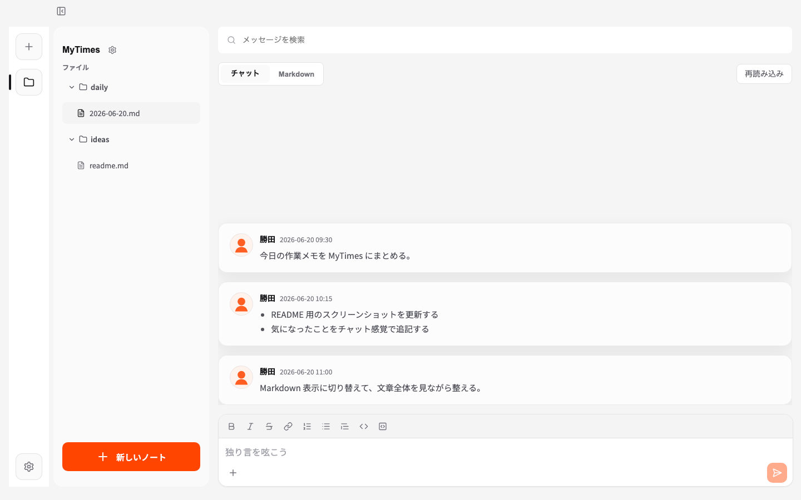
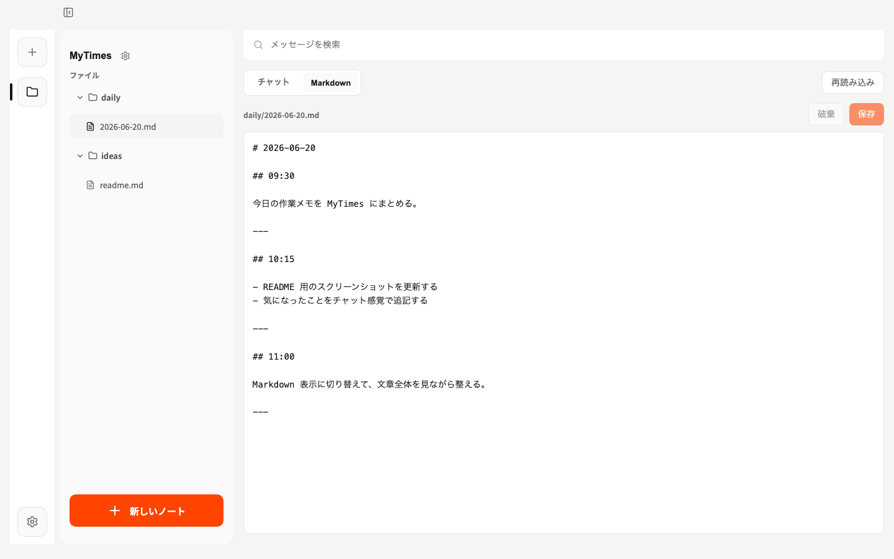
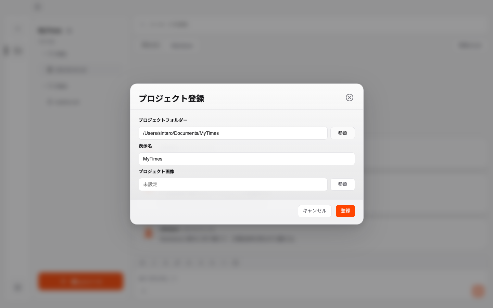

<div align="center">
  
  <h1>MyTimes</h1>
  <p>
    白いノートを開く前に、まず書ける。<br>
    MyTimes は、思考や作業ログをチャット感覚で Markdown に残すローカルファーストなデスクトップアプリです。
  </p>
  <p>
    <a href="https://github.com/sintaro-katuta/MyTimes/releases">
      
    </a>
    <a href="https://github.com/sintaro-katuta/MyTimes/actions/workflows/build.yml">
      
    </a>
  </p>
  <p>
    <a href="#mytimes-でできること">できること</a>
    ·
    <a href="#インストール">インストール</a>
    ·
    <a href="#使い方">使い方</a>
    ·
    <a href="#開発">開発</a>
  </p>
</div>

## MyTimes とは

MyTimes は、エンジニアや個人開発者が作業中の考え、詰まったこと、判断の理由、あとで拾いたいメモをすばやく残すための個人用タイムラインです。

Obsidian や通常の Markdown エディタは自由度が高い一方で、書き始めるまでに「ちゃんとまとめる」意識が入りやすくなります。MyTimes はその手前の、まだ整っていない思考をそのまま受け止める場所です。

書いた内容はローカルの Markdown ファイルに保存されます。アプリを使わなくなっても、記録は自分のフォルダーに残ります。

## こんな人に向いています

- 作業中の思考や試行錯誤を、分報のように残したい
- SNS に出すほどではない気づきやメモを、自分用に残したい
- Obsidian や VS Code で管理している Markdown フォルダーに、そのまま記録を積み上げたい
- 日報を書くほど重くない形で、あとから作業の流れを振り返りたい
- クラウドサービスではなく、ローカルに自分のデータを置きたい

## MyTimes でできること

### チャット感覚で書ける

入力欄から送信するだけで、選択中の Markdown ファイルに時刻付きで追記されます。文章を整える前に、まず記録できます。



### Markdown として残る

投稿は独自のデータベースだけに閉じ込めず、ローカルの Markdown ファイルに保存します。既存の Markdown フォルダーを登録して、普段のエディタや Obsidian と一緒に使えます。

### ノートを直接編集できる

チャット表示だけでなく、Markdown ファイル全体を直接編集できます。あとから整理したいときも、別アプリに移らずに直せます。



### プロジェクトごとに分けられる

仕事、個人開発、学習、生活ログなど、保存先フォルダーをプロジェクトとして登録できます。プロジェクトごとに表示名やアイコンも設定できます。



### v1 の主な機能

- ローカルフォルダーをプロジェクトとして登録
- Markdown ファイルの一覧表示、作成、リネーム、削除
- チャット形式で Markdown に追記
- Markdown 全文編集、手動保存、自動保存
- 外部エディタで変更した Markdown の再読み込み
- ライト、ダーク、システムテーマ
- テーマカラー、文字サイズ、表示密度の設定
- 最後に開いたプロジェクトとノートの復元
- 投稿へのリアクション、画像リアクション
- GitHub Releases 経由のアップデート確認

## インストール

[GitHub Releases](https://github.com/sintaro-katuta/MyTimes/releases) から、利用している OS に合う配布ファイルをダウンロードします。

| OS | ダウンロードするファイルの目安 |
| --- | --- |
| macOS | `.dmg` または `.app.tar.gz` |
| Windows | `.msi` または `.exe` |
| Linux | `.AppImage`、`.deb`、`.rpm` など |

1. 最新リリースの Assets を開く
2. 利用環境に合うファイルをダウンロードする
3. ダウンロードしたファイルを開き、OS の案内に沿ってインストールする
4. 初回起動時にセキュリティ警告が表示された場合は、信頼できるアプリとして実行を許可する

実際に利用できる OS と配布形式は、各リリースの Assets に含まれるファイルを確認してください。

## 使い方

### 1. プロジェクトを登録する

Markdown を保存するローカルフォルダーを選びます。既存の Markdown フォルダーでも、新しく用意した空のフォルダーでも使えます。

### 2. ノートを選ぶ、または作る

登録したフォルダー内の Markdown ファイルが一覧に表示されます。作業ログ用、日記用、プロジェクト用など、用途に合わせてノートを選びます。

### 3. 入力欄から投稿する

画面下部の入力欄に書いて送信すると、選択中の Markdown ファイルに追記されます。ノートを選んでいない状態では、当日の Markdown ファイルを作成して投稿できます。

### 4. 必要なときだけ Markdown を整える

記録をあとから整理したいときは、表示を `Markdown` に切り替えて全文を編集できます。

## データの扱い

MyTimes はローカルファーストなデスクトップアプリです。記録の本体は、ユーザーが選んだフォルダー内の Markdown ファイルに保存されます。

設定、表示用キャッシュ、リアクションなどの補助情報には SQLite を使います。Markdown ファイル自体は手元に残るため、他のエディタで開いたり、Git で管理したり、Obsidian の vault に入れたりできます。

## 開発

### 技術スタック

| Vue 3 | Tauri v2 | Rust | SQLite | Vite |
| --- | --- | --- | --- | --- |
|  |  |  |  |  |

UI は Vue 3 / Vite、ローカルファイル操作とアプリ機能は Tauri v2 / Rust、設定や表示用キャッシュは SQLite を使います。

### ローカル起動

```sh
npm ci
npm run tauri:dev
```

### 確認コマンド

```sh
cargo fmt --manifest-path src-tauri/Cargo.toml -- --check
cargo check --manifest-path src-tauri/Cargo.toml
npm run build
```

v1 公開前の動作、品質、公開手順の確認項目は [公開前チェックリスト](docs/pre-release-checklist.md) にまとめています。
