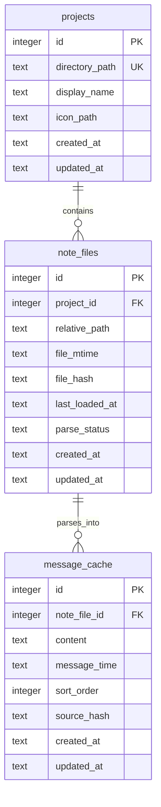

# プロジェクト構造設計

## 目的

Markdown をノート本文の正本にするため、左端のアイコン列で選択する単位を「フォルダー」や「ファイル」ではなく「プロジェクト」として扱う。

プロジェクトは、ユーザーが任意のローカルフォルダーを MyTimes に登録した作業領域であり、UI では一番左のペインに表示する。フォルダーとファイルは、プロジェクトを選択した右隣のペインに表示する。

後続の Markdown ファイル探索は、選択中プロジェクトが参照するルートディレクトリ `directory_path` を起点に `**/*.md` を読む。

例として、`Mytimes` フォルダーをプロジェクトとして登録した場合、右隣のペインには `frontend/` フォルダーや `readme.md` ファイルを表示する。`frontend/button.md` は、プロジェクト `Mytimes` 配下の `frontend` フォルダーにある Markdown ファイルとして扱う。

## 現状の課題

現在の `folders` は次の役割を同時に持っている。

- アプリ内の仮想フォルダツリー
- 左端 rail に表示する選択単位
- メッセージの分類先
- Markdown エクスポート先の相対パス

この構造のまま Markdown ファイルを正本にすると、一番左のペインで選ぶ「プロジェクト」と、その右ペインに表示する「フォルダー / ファイル」が混ざる。特に `folders.path` を変更すると子フォルダと `markdown_export_path` も更新されるため、プロジェクトの参照ルートとフォルダー階層の責務が分離できない。

## 用語

- プロジェクト: 任意のローカルフォルダーを MyTimes に登録した作業領域。一番左のペインに表示する
- 参照ルートディレクトリ: プロジェクトとして登録したローカルフォルダー。Markdown ファイル探索とフォルダー / ファイル作成の起点になる
- フォルダー: プロジェクトを選択した右隣のペインに表示する、参照ルートディレクトリ配下のディレクトリ
- ファイル: プロジェクトを選択した右隣のペインに表示する、参照ルートディレクトリ配下の `.md` ファイル
- ノート相対パス: 参照ルートディレクトリから見た `.md` ファイルの相対パス

## プロジェクトが保持する情報

プロジェクトは以下の情報を持つ。

- `directory_path`: Markdown ファイル探索の起点になる参照ルートディレクトリの絶対パス
- `display_name`: UI 表示名。未設定の場合は `directory_path` の末尾ディレクトリ名を表示する
- `icon_path`: 左端 rail に表示する任意の画像パス
- `created_at`
- `updated_at`

`directory_path` はプロジェクトとして登録したフォルダーの絶対パスである。ファイル探索、読み込み、保存、フォルダー作成、ファイル作成、外部編集検知は、この参照先を起点に行う。

`display_name` は左端ペインの UI ラベルであり、ファイル探索や保存先の正本にはしない。プロジェクト名を変更しても、参照ルートディレクトリ名やノート相対パスは変更しない。

## `projects` テーブルの扱い

DB テーブルは外部公開 API ではないため、`folders` テーブルを互換維持のために引きずらず、Markdown 正本化の方針に合わせて `projects` テーブルへ直接移行する。

`folders` の仮想フォルダツリー構造は廃止し、一番左のペインに表示するプロジェクト情報は `projects` に保持する。

### `projects` の列

- `id INTEGER PRIMARY KEY`
- `directory_path TEXT`
- `display_name TEXT`
- `icon_path TEXT`
- `created_at TEXT`
- `updated_at TEXT`

`directory_path` は必須で、同じディレクトリを重複登録しないように一意制約を付ける。

### ER 図

Markdown ファイルを正本とし、DB はプロジェクト情報と Markdown から再生成できるキャッシュを保持する。

`note_files.relative_path` は `readme.md` や `frontend/button.md` のように、プロジェクトの `directory_path` からの相対パスを保持する。実ファイルの本文は Markdown ファイルが正本であり、`message_cache` はチャット表示用に再生成できるキャッシュとして扱う。

### 廃止する `folders` 由来の概念

- `parent_id`: プロジェクトは階層化しない。階層は参照ルートディレクトリ配下のフォルダーとして扱う
- `path`: 仮想フォルダパスとしては使わない。ノートは `directory_path` からの相対パスで識別する
- `markdown_export_path`: Markdown 正本化後はエクスポート先ではなく、プロジェクトの `directory_path` を読み書きの起点にする
- `messages.folder_id`: Markdown から再生成されるキャッシュは project とノート相対パスへ紐づける

## UI 方針

### 左端 rail

左端 rail はプロジェクト一覧を表示する。

- 各項目は 1 つの `directory_path` を持つ
- アイコンは `icon_path` があれば画像、なければフォルダアイコンを表示する
- 選択すると、右隣のペインに参照ルートディレクトリ配下のフォルダーと `.md` ファイルを表示する

### 右隣のペイン

プロジェクトの右隣のペインは、選択中プロジェクト配下のフォルダーとファイルを表示する。

- 表示対象は `directory_path` 配下に限定する
- フォルダーはナビゲーション単位として扱う
- `.md` ファイルはノート選択単位として扱う
- フォルダーやファイルはプロジェクトではない
- フォルダー作成とファイル作成は、選択中プロジェクトの `directory_path` 配下に対して行う

例:

- `directory_path`: `/Users/me/Notes/Mytimes`
- フォルダー: `frontend`
- ファイル: `readme.md`
- ファイル: `frontend/button.md`

### プロジェクト追加

プロジェクト追加時は、任意のローカルフォルダーを選択し、そのフォルダーをプロジェクトとして登録する。

1. OS のディレクトリ選択ダイアログを開く
2. 選択された絶対パスを `directory_path` に保存する
3. `display_name` が未入力なら、ディレクトリ名を表示名にする
4. 同じ `directory_path` の重複登録を防ぐ

新規プロジェクト作成時に参照ルートディレクトリ自体を作成するかどうかは、初期実装では扱わない。まず既存フォルダーをプロジェクトとして登録する操作に絞る。

### プロジェクト設定

プロジェクト設定では以下を編集できる。

- 表示名
- アイコン画像
- 参照ディレクトリ

参照ディレクトリを変更した場合は、別プロジェクトへ切り替えるのと同じ扱いで `.md` ファイル一覧と DB キャッシュを再読み込みする。

## ルート / すべて表示の扱い

Markdown 正本化後は、アプリ全体の「すべて」表示を正規の編集コンテキストにしない。

- チャット投稿、Markdown 保存、ファイル作成には必ず選択中プロジェクトが必要
- 「すべて」は検索結果や横断閲覧として残す余地はある
- 初期実装では混乱を避けるため、プロジェクト未選択時は投稿と Markdown 保存を無効にする

複数プロジェクトをまたぐファイル一覧は、ファイル探索と保存先の責務が曖昧になるため `MYT-22` 以降の初期実装には含めない。

## Markdown ファイル探索

後続の `MYT-22` では、ファイル探索を次の形に寄せる。

- 入力: `projectId`
- DB から `directory_path` を取得する
- `directory_path/**/*.md` を探索する
- UI には参照ルートディレクトリからの相対パスを返す
- 読み込み、保存 command は `projectId` とノート相対パスを受け取る
- 正規化後のパスが `directory_path` の外へ出る場合は拒否する

UI は絶対パスをノート識別子として扱わない。ノート選択状態は `projectId` とノート相対パスの組で表す。

## 既存データ移行方針

既存 `folders` データは `projects` へ変換し、変換後は `folders` を通常運用に使わない。

1. `markdown_export_path` が絶対パスなら、それを `projects.directory_path` の候補にする。
2. アプリ全体の Markdown 保存先があり、`markdown_export_path` が相対パスなら、全体保存先と結合したパスを `projects.directory_path` の候補にする。
3. どちらも使えない場合は、ユーザーにプロジェクトとして登録するフォルダー選択を促す。
4. `projects.display_name` は既存 `folders.name` を初期値にする。
5. `projects.icon_path` は既存 `folders.icon_path` を引き継ぐ。
6. `folders.parent_id` による階層はプロジェクト構造へ引き継がない。実ディレクトリ配下のフォルダー構造を表示する。
7. 移行後のメッセージキャッシュは、Markdown ファイルを読み直して project とノート相対パスへ紐づけ直す。

既存 DB にだけ存在する本文の Markdown 書き出しは、[Markdown正本化設計](markdown-canonical.md) の既存データ移行方針に従う。既存 Markdown ファイルを自動上書きしないことを優先する。

## 後続実装への影響

- `MYT-22`: Rust command は `directory_path` を起点に `.md` ファイルを探索する
- `MYT-23`: パース済みメッセージは `projectId + noteRelativePath` に紐づける
- `MYT-24`: UI の選択状態はプロジェクトとノート相対パスを基準にする
- `MYT-25`: 外部編集検知はプロジェクトの参照ルートディレクトリ単位で行う

## 未決定事項

- 既存 UI 文言の「フォルダ」を「プロジェクト」と「フォルダー」にどう分離するか
- 参照ルートディレクトリが削除、移動、アクセス不能になった場合の復旧 UI
